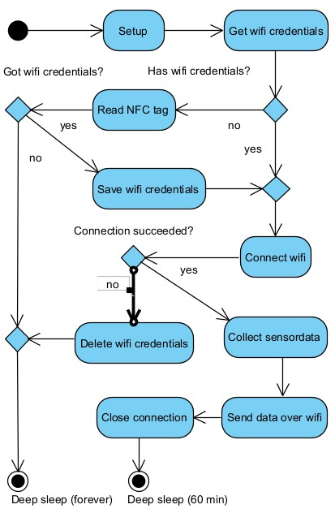

Technical Documentation
=======================

Here you'll find the technical documentation for the Gaia plantsensor firmware.

Pinout
------

Here you'll find the pinout for the Gaia plantsensor.

In text form, the following pins are used:

=== ========== ===========
Pin Function   Description
=== ========== ===========
1   DIGITAL IN |pin01|
--- ---------- -----------
2   SPI MISO   |pin02|
--- ---------- -----------
3   ADC IN     |pin03|
--- ---------- -----------
4   ADC IN     |pin04|
--- ---------- -----------
6   SPI CLK    |pin06|
--- ---------- -----------
7   SPI MOSI   |pin07|
--- ---------- -----------
10  SPI CS0    |pin10|
=== ========== ===========

.. |pin01| replace:: Connected to the soil capacity sensor, we measure the time between highs to determine a value, therefore it's a digital pin.
.. |pin02| replace:: The SPI Master-In-Slave-Out pin, used to communicate to the RFID reader.
.. |pin03| replace:: Connect to an LDR, reads an analogue value.
.. |pin04| replace:: Connected to the battery, this pin is used to measure the battery capacity of the device.
.. |pin06| replace:: The SPI clock pin, used to communicate to the RFID reader.
.. |pin07| replace:: The SPI Master-Out-Slave-In pin, used to communicate to the RFID reader.
.. |pin10| replace:: [Active LOW] The SPI Chip Select 0 pin. This pin is used to enable SPI communication to the RFID device.

**TODO:** pinout image

Activity Diagram
-----------------

This diagram describes the flow of the gaia plantsensor app.

Block Diagram
-------------

This diagram shows the internal relations between components in the system

